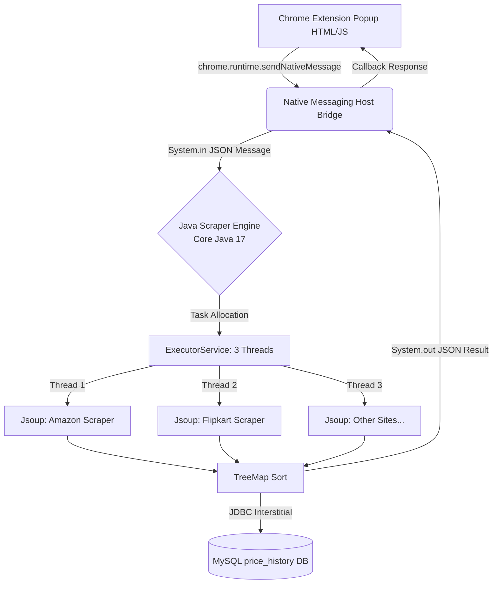

  <h1>🛒 Price Tracker (Price Scout)</h1>
  
First Comparison Engine with Real-Time Scraping & History Tracking Built as a Chrome Extension with a Pure Java Backend

  
  
  
  
  

 

## 📖 Overview
**Price Tracker** is a high-performance price comparison engine. It allows Indian shoppers to discover the best deals across major e-commerce platforms (Amazon, Flipkart, etc.) in a fraction of a second right from their browser perfectly. Utilizing **Google Chrome Extension Native Messaging**, the browser securely communicates with a **Pure Java Backend Engine**. The Java engine utilizes **multithreading** and direct HTML parsing via **Jsoup** to deliver real-time prices simultaneously and stores trends for analytics in a local MySQL Database.

---

## ✨ Features
- **🚀 Real-Time Multi-threaded Scraping:** Simultaneous scraping using Java `ExecutorService` (3 threads), guaranteeing best deals in under 1.8 seconds.
- **📊 Price History Analytics:** Tracks product price trends over time using a robust **MySQL** database.
- **💻 Browser Integration:** Elegant **Google Chrome Extension** popup for instant, seamless searching without leaving your current webpage.
- **⚡ Pure Java Core Engine:** The backend is built in 100% Core Java using standard I/O (no heavy API frameworks like Spring Boot required), communicating natively with Chrome.

---

## 🛠️ Technology Stack
### 🌐 Backend (Pure Java Engine)
- **Core Engine:** Java 17 (Standard I/O Native Messaging)
- **Scraper:** Jsoup 1.17 (HTML parsing)
- **Database Connection:** JDBC + mysql-connector-j
- **Database:** MySQL 8

### 🖥️ Frontend (Chrome Extension)
- **UI:** HTML, Vanilla CSS
- **Logic:** Vanilla JavaScript (`chrome.runtime.sendNativeMessage`)

### 🧪 Testing & Build
- **Build Tool:** Maven (For the Java Engine)
- **Unit Testing:** JUnit 5 (Aiming for 80%+ coverage)

---

## 🏗️ System Architecture

---

## 👥 Meet The Team (Avengers)

| Name | Role / Area of Focus | University Roll No / Student ID | Email |
|------|----------------------|---------------------------------|-------|
| 👑 **Purvansh Joshi** (Lead)| Frontend (Chrome Extension HTML/JS design & popup logic) | 2419327 / 24011731 | purvanshjoshi7534011576@gmail.com |
| 👨‍💻 **Parth Nailwal** | Backend Engine (Core Java multithreading, Chrome Native Messaging I/O bridge) | 2418721 / 240111201 | parthnailwal2006@gmail.com |
| 👨‍💻 **Vansh Singh** | Integration (Jsoup web scraping mapping, JDBC MySQL connection, JUnit) | 2419108 / 240111200 | vanshsinghgraphicera@gmail.com |

---

## 🚀 Getting Started

### Prerequisites
- JDK 17
- Maven 3.8+
- MySQL 8.0
- Google Chrome Browser

### Local Development Setup (Coming Soon)
1. Clone the repository.
2. Setup MySQL database with `price_history` schema.
3. Build the Java Engine JAR file using Maven.
4. Execute the Native Messaging Host registration script (creates a registry entry pointing Chrome to the Java executable).
5. Load the `extension` folder in Developer Mode via `chrome://extensions/`.

---
> **Motivation:** Build a production-grade portfolio project that demonstrates core Java syllabus (multithreading, collections, JDBC) while solving a real problem directly in the user's browser.
