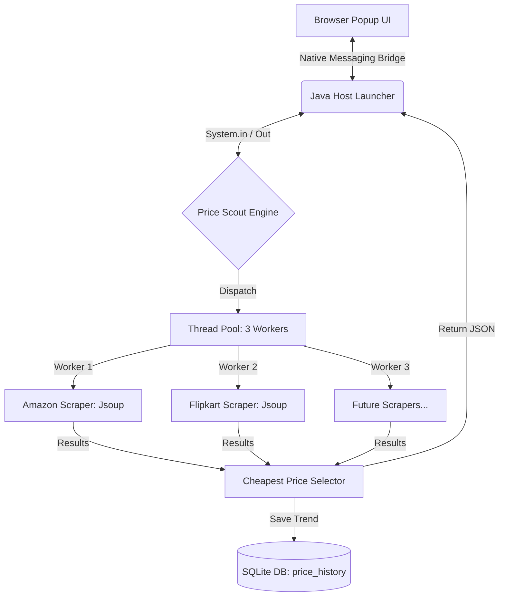

<div align="center">
  
  <h1>🛒 Price Scout (Price Tracker)</h1>
  <p><strong>Real-Time Price Discovery & History Engine</strong></p>
  <p><i>Find the best deals across Amazon & Flipkart instantly with a multithreaded Core Java backend and a seamless Chrome Extension.</i></p>

  [](https://www.java.com/)
  [](https://developer.chrome.com/docs/extensions/)
  [](https://www.sqlite.org/)
  [](https://jsoup.org/)
  [](LICENSE)
</div>

<br />

## 📖 Overview
**Price Scout** is a high-performance price comparison engine designed to eliminate "tab fatigue" for Indian shoppers. Unlike traditional price trackers that rely on cached data, Price Scout performs **real-time scraping** to deliver the absolute latest prices in under 2 seconds.

Built as a hybrid system, it uses an elegant **Chrome Extension** for the frontend and a **Pure Java Backend Engine** for heavy-duty scraping. Communication is handled via **Chrome Native Messaging**, providing a secure and lightning-fast bridge between the browser and the local machine.

---

## ✨ Key Features
- **🚀 Ultra-Fast Concurrent Scraping:** Utilizes Java's `ExecutorService` with 3 dedicated threads to scrape Amazon and Flipkart simultaneously.
- **📊 Local Price Analytics:** Every search is logged in a local **SQLite** database, building a personal price history for trend analysis.
- **⚡ Native Messaging Bridge:** Secure, low-latency communication between JavaScript and Java using a byte-prefixed JSON protocol.
- **🛠️ Zero-Config Database:** No heavy database servers required; uses SQLite for persistent, file-based storage.
- **🎯 Precision Filters:** Automatically filters out sponsored results to show only legitimate top-match products.

---

## 🏗️ System Architecture



---

## 🛠️ Technology Stack

| Layer | Technologies |
| :--- | :--- |
| **Backend Core** | Java 17, Maven |
| **Scraping Engine** | Jsoup 1.17 (HTML Parsing / CSS Selectors) |
| **Concurrency** | `java.util.concurrent` (ExecutorService, Future, Callable) |
| **Database** | SQLite (via JDBC) |
| **Communication** | Chrome Native Messaging (Standard I/O) |
| **Frontend** | HTML5, Vanilla CSS3, JavaScript (Chrome Extension API) |

---

## 🚀 Getting Started

### Prerequisites
* **Java Development Kit (JDK) 17** or higher.
* **Maven 3.8+** for building the project.
* **Google Chrome** browser.

### 1. Build the Backend Engine
Navigate to the `backend` folder and package the Java application:
```bash
cd backend
mvn clean package
```
This generates `PriceTrackerEngine.jar` in the `target/` directory.

### 2. Register the Native Messaging Host
Chrome needs to know where the Java engine is located.
* **Windows:** 
  1. Open `host-config/com.pricetracker.engine.json`.
  2. Ensure the `path` points to your `engine_launcher.bat`.
  3. Update the registry key: `HKEY_CURRENT_USER\Software\Google\Chrome\NativeMessagingHosts\com.pricetracker.engine` to point to this JSON file.

### 3. Load the Extension
1. Open Chrome and go to `chrome://extensions/`.
2. Enable **Developer mode** (top-right toggle).
3. Click **Load unpacked** and select the `extension` folder from this repository.

---

## 👥 The Avengers (Meet the Team)

| Name | Role | Student ID | GitHub |
| :--- | :--- | :--- | :--- |
| 👑 **Purvansh Joshi** | Project Lead & Frontend Architect | 24011731 | [@PurvanshJoshi](https://github.com/PurvanshJoshi) |
| 👨‍💻 **Parth Nailwal** | Backend Core & Concurrency Specialist | 240111201 | [@parthnailwal](https://github.com/parthnailwal) |
| 👨‍💻 **Vansh Singh** | Scraper Logic & JDBC Integration | 240111200 | [@vanshsingh](https://github.com/vanshsingh) |

---

## 📜 License
This project is licensed under the MIT License - see the [LICENSE](LICENSE) file for details.

> **Project Goal:** Demonstrate the power of Core Java (Multithreading, I/O, JDBC) in a real-world, user-facing application while providing shoppers with a tool that actually works.
