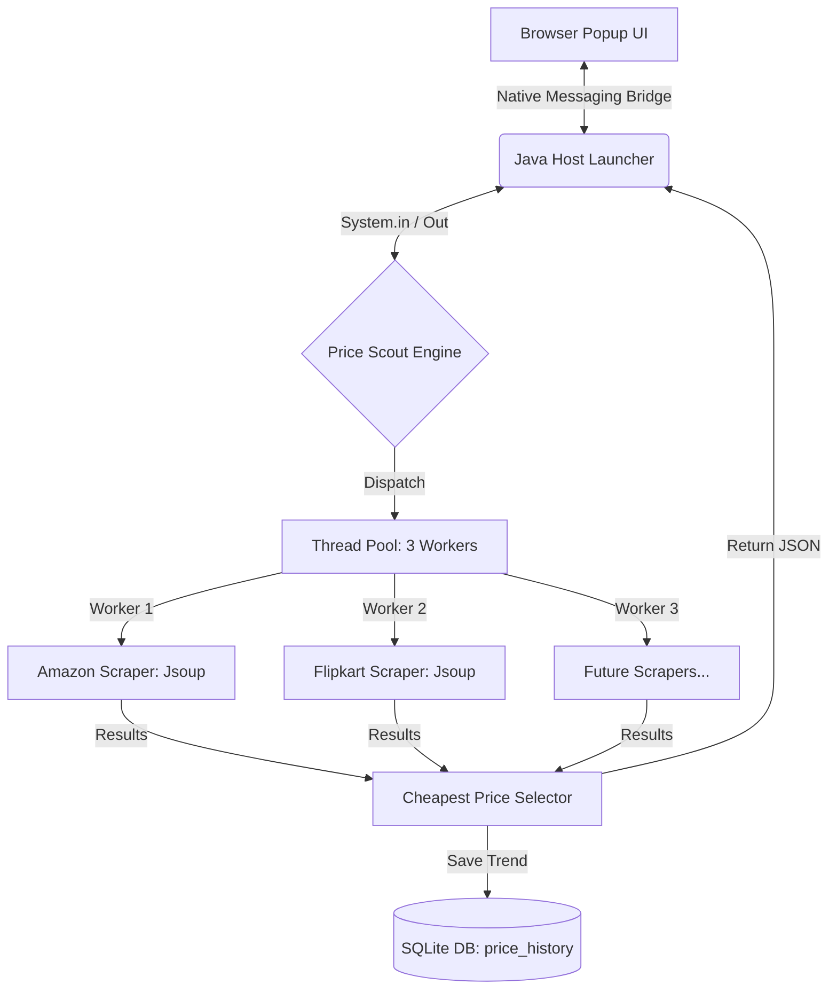

<div align="center">
  
  <h1>🚀 Price Scout</h1>
  <p><strong>The Intelligent Real-Time Price Discovery Engine</strong></p>
  <p><i>Stop chasing deals. Let them come to you with a multithreaded Core Java backend and a premium Chrome Extension experience.</i></p>

  <p>
    
    
    
    
  </p>
</div>

<br />

## 🌟 The Vision
In an era of dynamic pricing and "Big Billion" sales, manual price checking is a waste of time. **Price Scout** is a performance-first tool designed by **The Avengers** to deliver real-time product data directly from the source. No more old, cached prices—just the absolute latest truth from Amazon and Flipkart, delivered in milliseconds.

## 🎯 Why Price Scout?
Traditional trackers often show prices that are hours or even days old. **Price Scout** is different:
- **Zero Latency:** We don't use a "middleman" API. The scraping happens locally on your machine.
- **Privacy First:** Your search data stays in your local SQLite database, not on our servers.
- **Pure Performance:** Multi-threaded execution means we check multiple stores at the exact same time.

---

## ⚡ Key Highlights
- **💨 Concurrent Engine:** Powered by Java `ExecutorService`, our engine spawns multiple workers to race for the best price.
- **🔍 4-Byte Native Protocol:** Uses the high-speed **Chrome Native Messaging** bridge to communicate between Java and JS.
- **📦 Zero-Configuration SQL:** Leverages SQLite for a portable, file-based history that requires no server setup.
- **🎭 Intelligent Selectors:** Advanced Jsoup implementation that adapts to e-commerce site structures.
- **📊 Trend Awareness:** Logs every lookup with precision timestamps to help you identify price drops over time.

---

## 🏗️ System Architecture



---

## 🛠️ Technology Stack

| Layer | Technologies |
| :--- | :--- |
| **Backend Core** | Java 17, Maven |
| **Scraping Engine** | Jsoup 1.17 (HTML Parsing / CSS Selectors) |
| **Concurrency** | `java.util.concurrent` (ExecutorService, Future, Callable) |
| **Database** | SQLite (via JDBC) |
| **Communication** | Chrome Native Messaging (Standard I/O) |
| **Frontend** | HTML5, Vanilla CSS3, JavaScript (Chrome Extension API) |

---

## 🚀 Getting Started

### Prerequisites
* **Java Development Kit (JDK) 17** or higher.
* **Maven 3.8+** for building the project.
* **Google Chrome** browser.

### 1. Build the Backend Engine
Navigate to the `backend` folder and package the Java application:
```bash
cd backend
mvn clean package
```
This generates `PriceTrackerEngine.jar` in the `target/` directory.

### 2. Register the Native Messaging Host
Chrome needs to know where the Java engine is located.
* **Windows:** 
  1. Open `host-config/com.pricetracker.engine.json`.
  2. Ensure the `path` points to your `engine_launcher.bat`.
  3. Update the registry key: `HKEY_CURRENT_USER\Software\Google\Chrome\NativeMessagingHosts\com.pricetracker.engine` to point to this JSON file.

### 3. Load the Extension
1. Open Chrome and go to `chrome://extensions/`.
2. Enable **Developer mode** (top-right toggle).
3. Click **Load unpacked** and select the `extension` folder from this repository.

---

## 👥 The Avengers (Meet the Team)

| Name | Role | Student ID | GitHub |
| :--- | :--- | :--- | :--- |
| 👑 **Purvansh Joshi** | Project Lead & Frontend Architect | 24011731 | [@PurvanshJoshi](https://github.com/PurvanshJoshi) |
| 👨‍💻 **Parth Nailwal** | Backend Core & Concurrency Specialist | 240111201 | [@parthnailwal](https://github.com/parthnailwal) |
| 👨‍💻 **Vansh Singh** | Scraper Logic & JDBC Integration | 240111200 | [@vanshsingh](https://github.com/vanshsingh) |

---

## 📜 License
This project is licensed under the MIT License - see the [LICENSE](LICENSE) file for details.

> **Project Goal:** Demonstrate the power of Core Java (Multithreading, I/O, JDBC) in a real-world, user-facing application while providing shoppers with a tool that actually works.
