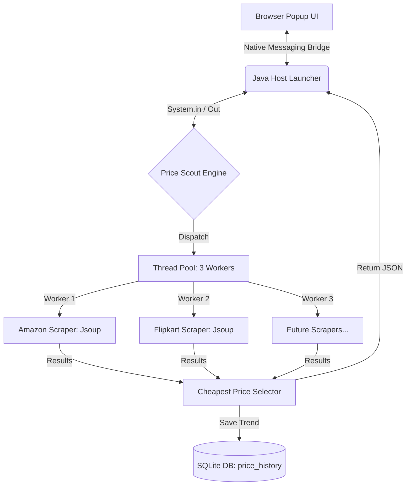

  
  <h1>🚀 Price Scout</h1>
  
<strong>The Intelligent Real-Time Price Discovery Engine</strong>

  
<i>Stop chasing deals. Let them come to you with a multithreaded Core Java backend and a premium Chrome Extension experience.</i>

  

    
    
    
    
  

 

## 🌟 The Vision
In an era of dynamic pricing and "Big Billion" sales, manual price checking is a waste of time. **Price Scout** is a performance-first tool designed by **The Avengers** to deliver real-time product data directly from the source. No more old, cached prices—just the absolute latest truth from Amazon and Flipkart, delivered in milliseconds.

## 🎯 Why Price Scout?
Traditional trackers often show prices that are hours or even days old. **Price Scout** is different:
- **Zero Latency:** We don't use a "middleman" API. The scraping happens locally on your machine.
- **Privacy First:** Your search data stays in your local SQLite database, not on our servers.
- **Pure Performance:** Multi-threaded execution means we check multiple stores at the exact same time.

---

## ⚡ Key Highlights
- **💨 Concurrent Engine:** Powered by Java `ExecutorService`, our engine spawns multiple workers to race for the best price.
- **🔍 4-Byte Native Protocol:** Uses the high-speed **Chrome Native Messaging** bridge to communicate between Java and JS.
- **📦 Zero-Configuration SQL:** Leverages SQLite for a portable, file-based history that requires no server setup.
- **🎭 Intelligent Selectors:** Advanced Jsoup implementation that adapts to e-commerce site structures.
- **📊 Trend Awareness:** Logs every lookup with precision timestamps to help you identify price drops over time.

---

## 🏗️ System Architecture

---

---

## 🛠️ The Core Technology Stack

| Layer | Tools & Technologies |
| :--- | :--- |
| **Backend Core** |   |
| **Parsing Engine** |  (HTML DOM / CSS Selectors) |
| **Concurrency** | `java.util.concurrent` (ExecutorService, Async Future) |
| **Database** |  (Zero-Configuration Persistent Storage) |
| **Messaging** | **Chrome Native Messaging** (4-Byte Byte-Stream Protocol) |
| **Frontend UI** |    |

---

## 🚀 Deployment & Installation
Running **Price Scout** requires a quick one-time handshake between your browser and your machine.

### 📋 Prerequisites
- **JDK 17+** & **Maven** installed.
- **Google Chrome** browser.

### 🛠️ Setup in 3 Quick Steps
For a complete walkthrough, see the [Detailed Setup Guide](docs/setup_guide.md).

1. **Build the Engine:** Run `mvn clean package` inside the `backend` folder.
2. **Register Host:** Link your registry via the `host-config/` scripts.
3. **Install Extension:** Load the `extension/` folder in Chrome Developer Mode.

---

## 🦸‍♂️ The Avengers (Engineered by)

| Hero | Role | Focus | GitHub |
| :--- | :--- | :--- | :--- |
| 🛡️ **Purvansh Joshi** | **Architect** | UI/UX & Native Messaging | [@PurvanshJoshi](https://github.com/PurvanshJoshi) |
| ⚡ **Parth Nailwal** | **Backend Lead** | Multithreading & Logic | [@parthnailwal](https://github.com/parthnailwal) |
| 🏹 **Vansh Singh** | **Data Lead** | Scrapers & SQLite | [@vanshsingh](https://github.com/vanshsingh) |

 

  
<i>"The power of Java, the reach of the Browser."</i>

  

