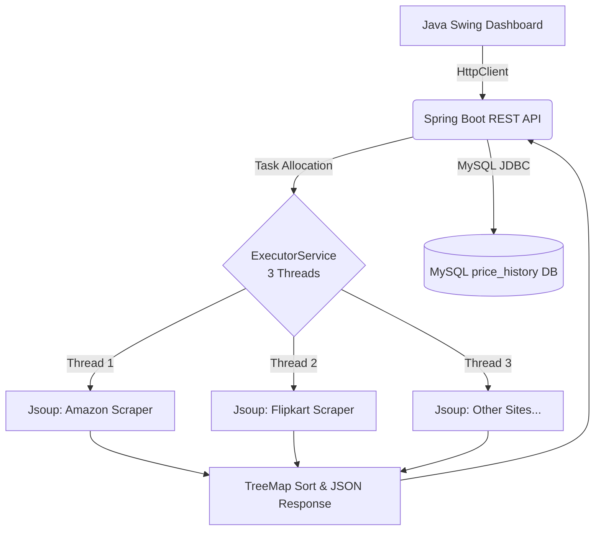

<div align="center">
  <h1>🛒 Price Tracker (Price Scout)</h1>
  <p>First Comparison Engine with Real-Time Scraping & History Tracking</p>
  
  [](https://www.java.com/)
  [](https://spring.io/projects/spring-boot)
  [](https://www.mysql.com/)
  [](#)
</div>

<br />

## 📖 Overview
**Price Tracker** is a high-performance price comparison engine built entirely in Java. It allows Indian shoppers to discover the best deals across major e-commerce platforms (Amazon, Flipkart, etc.) in a fraction of a second. Utilizing **Java multithreading** and direct HTML parsing via **Jsoup**, Price Tracker delivers real-time prices simultaneously and stores trends for analytics.

---

## ✨ Features
- **🚀 Real-Time Multi-threaded Scraping:** Simultaneous scraping using `ExecutorService` (3 threads), guaranteeing best deals in under 1.8 seconds.
- **📊 Price History Analytics:** Tracks product price trends over time using a robust **MySQL** database.
- **💻 Desktop Dashboard:** Elegant local **Java Swing** GUI for quick comparison and historical data visualization.
- **⚡ Independent API Backend:** A dedicated **Spring Boot REST API** parsing raw DOM securely via CSS selectors, with zero dependency on restricted third-party APIs.

---

## 🛠️ Technology Stack
### 🌐 Backend
- **Core Engine:** Java 17
- **Framework:** Spring Boot 3.x
- **Scraper:** Jsoup 1.17 (HTML parsing)
- **Database:** MySQL 8

### 🖥️ Frontend (Desktop Client)
- **GUI:** Java Swing (`JFrame` / `JTable`)
- **Integration:** Native `HttpClient`, `org.json`

### 🧪 Testing & Build
- **Build Tool:** Maven
- **Unit Testing:** JUnit 5 (Aiming for 80%+ coverage)
- **API Testing:** Postman

---

## 🏗️ System Architecture



---

## 👥 Meet The Team (Avengers)

| Name | Role / Area of Focus | University Roll No / Student ID | Email |
|------|----------------------|---------------------------------|-------|
| 👑 **Purvansh Joshi** (Lead)| Frontend (Java Swing Dashboard) & API Integration | 2419327 / 24011731 | purvanshjoshi7534011576@gmail.com |
| 👨‍💻 **Parth Nailwal** | Backend (Spring Boot API, Core multithreading algorithm) | 2418721 / 240111201 | parthnailwal2006@gmail.com |
| 👨‍💻 **Vansh Singh** | Integration (Jsoup end-to-end, MySQL, JUnit) | 2419108 / 240111200 | vanshsinghgraphicera@gmail.com |

---

## 🚀 Getting Started

### Prerequisites
- JDK 17
- Maven 3.8+
- MySQL 8.0

### Local Development Setup (Coming Soon)
1. Clone the repository:
   ```bash
   git clone https://github.com/your-username/Price-Tracker.git
   ```
2. Setup MySQL database with `price_history` schema.
3. Configure `application.properties` with your database credentials.
4. Run the Spring Boot Backend.
5. Launch the Java Swing Client App.

---
> **Motivation:** Build a production-grade portfolio project that demonstrates core Java syllabus (multithreading, collections, JDBC, Swing) while solving a real problem.
