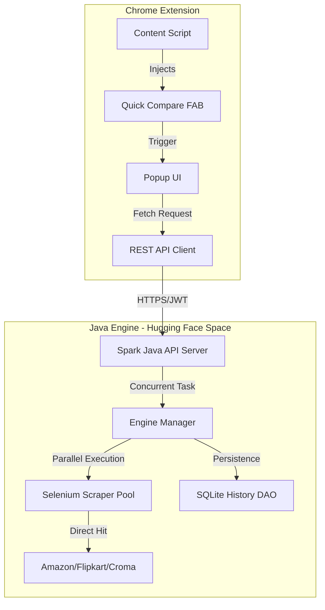
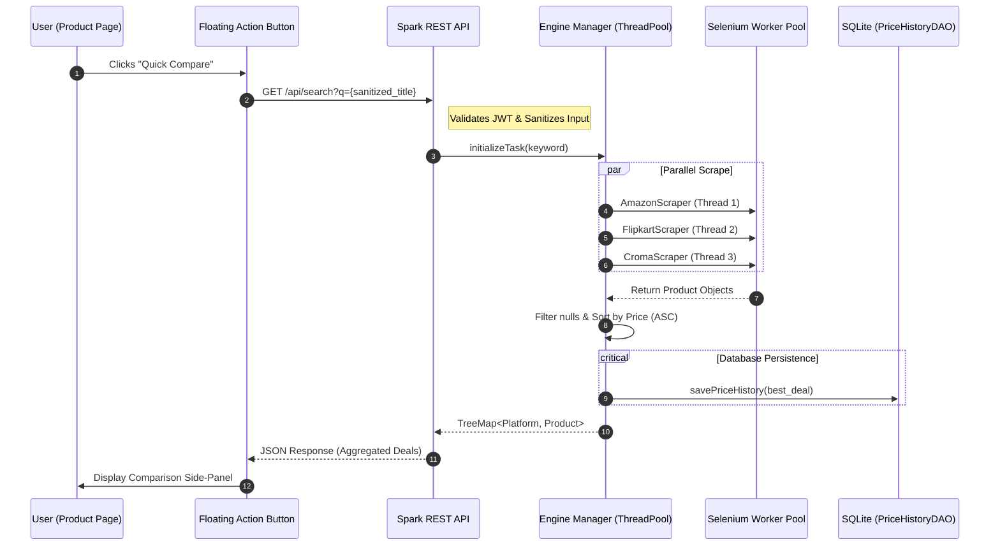

<div align="center">
  
  <h1>Price Scout: Advanced Price Discovery & Analytics Platform</h1>
  <p>
    
    
    
    
  </p>
</div>

Price Scout is a high-performance, distributed price tracking solution comprising a containerized Java REST API and a manifest V3 Chrome extension. The system is engineered to provide real-time product intelligence by bypassing traditional caching layers and interfacing directly with e-commerce platforms through headless browser automation.

---

## System Architecture

The platform follows a decoupled client-server architecture. The Chrome Extension acts as the presentation and injection layer, while the Java Engine serves as the scraping and data persistence core.

### High-Level Component Diagram


---

## Technical Specifications

### Backend Core
- **Runtime**: OpenJDK 17
- **Web Framework**: Spark Java (Lighweight REST API)
- **Browser Automation**: Selenium 4.16.1 with WebDriverManager
- **Stealth Integration**: Custom User-Agent rotation and AutomationControlled bypass
- **Database**: SQLite 3.45 for persistent temporal price tracking

### Frontend Interface
- **Platform**: Chrome Extension Manifest V3
- **In-page Logic**: Vanilla JavaScript with DOM Mutation Observers
- **Communication**: Fetch-based REST interaction with JWT authentication
- **Styling**: Scoped CSS to prevent conflicts with host platform styles

---

## Operational Workflow

The following sequence diagram provides a granular look at the request lifecycle, highlighting the internal parallelization and data aggregation logic.



---

## Technical Micro-Details

### Stealth Scraping Architecture
The system employs a multi-layered bypass strategy to ensure consistent data retrieval from highly protected endpoints:
1. **Automation Bypass**: Dynamic `cdc_` variable stripping in the ChromeDriver to prevent `navigator.webdriver` detection.
2. **Behavioral Mimicry**: Randomized `scrollBy` and `mouseMove` events to simulate human interaction during page load.
3. **Identity Rotation**: Each worker thread utilizes a distinct User-Agent string from a randomized pool, mitigating fingerprinting patterns.

### Data Persistence Schema
Price Scout utilizes a temporal schema to track market fluctuations over time.
- **Table: `price_history`**
  - `product_name`: Primary lookup key (Indexed).
  - `platform`: Origin store identifier.
  - `price`: Normalized floating-point value.
  - `url`: Direct canonical link.
  - `scraped_at`: High-precision timestamp (Automatic).

---

## API Security Implementation

### Input Sanitization Protocol
Every search string is processed through a strict whitelist filter:
```java
String sanitizedQuery = query.replaceAll("[^a-zA-Z0-9\\s]", "").trim();
```
This ensures that the product title used for DOM extraction or Selenium navigation cannot be used as an injection vector for the headless browser or the backend OS.

### JWT Lifecycle
1. **Issuance**: Tokens are cryptographically signed with HMAC-256.
2. **Authorization**: All endpoints (`/api/search`, `/api/history`) are gated behind a `before()` filter.
3. **Integrity**: The backend enforces strict expiration (`exp`) and issuer (`iss`) checks on every inbound request.

---

## Security & Compliance

### Data Integrity
All incoming search queries undergo regex-based sanitization (`[^a-zA-Z0-9\s]`) to mitigate XSS and command injection risks. The system enforces domain-level validation to prevent SSRF (Server-Side Request Forgery) by strictly allowing connections to a predefined whitelist of e-commerce domains.

### Resource Management
The engine utilizes a shared `ExecutorService` with a fixed thread pool to manage concurrent scraping tasks, preventing thread exhaustion and ensuring stable response times under load.

---

## Installation & Deployment

### Backend Deployment (Docker)
The backend is designed to run in a containerized environment.
```bash
# Build the container
docker build -t price-scout-engine .

# Run locally
docker run -p 7860:7860 price-scout-engine
```

### Extension Installation
1. Navigate to `chrome://extensions`.
2. Enable "Developer Mode".
3. Select "Load Unpacked" and point to the `extension/` directory.

---

## Project Roadmap

The development follows a phased approach to increase intelligence and resilience:

1. **Phase 1 (Complete)**: Transition to Cloud-native architecture and Selenium Stealth integration.
2. **Phase 2 (Current)**: Implementation of Temporal Price History and SQL Persistence.
3. **Phase 3 (Planned)**: Integration of Linear Regression models for price drop prediction.
4. **Phase 4 (Planned)**: Automated Proxy Rotation and Redis Caching Layer.

---

## License
Distributed under the MIT License. See `LICENSE` for more information.
