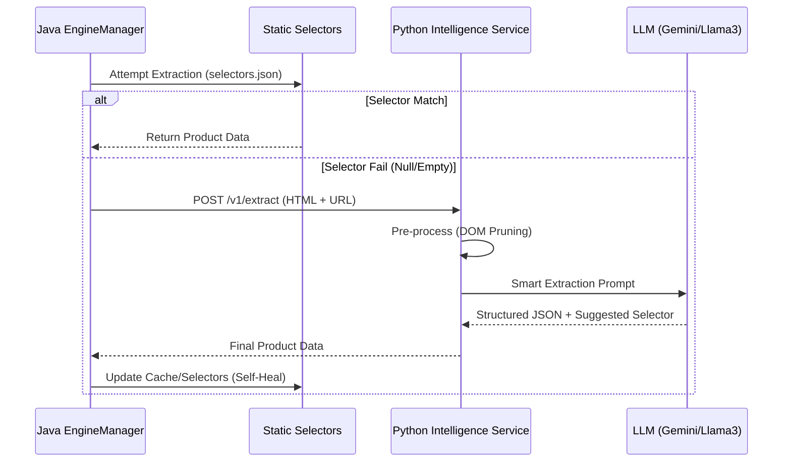

## Overview
This proposal outlines the integration of an LLM-powered extraction engine, specifically ScrapeGraphAI, to move away from fragile CSS/XPath-based data collection. The goal is to create a self-healing scraper that remains functional regardless of website layout changes.

## Architectural Visualization

## Current Problem
Our current architecture relies on a `selectors.json` file. While efficient, it suffers from several critical drawbacks:
1. **High Maintenance**: Major retailers like Amazon and Flipkart frequently rotate class names and DOM structures, causing immediate scraper failure.
2. **Scalability**: Adding new retailers requires manual inspection of the DOM and authoring of specific selectors.
3. **Fragility**: Minor UI tweaks (e.g., promotional banners) can shift the DOM tree and break XPath references.

## Proposed Solution: Deep Technical Breakdown

### 1. Intelligent Extraction Layer (Python FastAPI)
A lightweight Python service will act as the "Intelligence Proxy."
- **Core Technology**: Python 3.11+, ScrapeGraphAI 1.2+, FastAPI.
- **Async Execution**: Utilizes `FastAPI` with `Gunicorn` (uvicorn workers) to handle high-concurrency requests from the Java core.
- **Endpoint Specification**: `POST /v1/extract`
  - **Inputs**: 
    - `html_content`: The raw body of the page.
    - `context`: JSON containing metadata (retailer name, current version).
  - **Processing**: The service uses the `SmartScraperGraph` class to execute the extraction logic.

### 2. Advanced LLM Orchestration & Cost Optimization
We will avoid a "one-size-fits-all" approach to LLMs:
- **Primary Agent**: **Gemini 1.5 Flash**. Chosen for its 1-million token context window and significantly lower cost/latency compared to Pro.
- **Local Agent**: **Ollama (Llama 3 8B)**. Used for internal benchmarking and non-critical retailers to eliminate API costs.
- **Fallback Agent**: **GPT-4o**. Only triggered if the confidence score of the primary extraction is below 0.8.

### 3. Self-Healing Selector Engine (The Feedback Loop)
This is the most critical "micro-detail":
1. When the LLM successfully extracts a price, it is also prompted to: *"Identify a stable CSS selector for the extracted element."*
2. The Python service returns this selector string to the Java backend.
3. The Java backend performs a **Verification Check**: It runs the suggested selector against the *same* HTML to see if it yields the same result.
4. If it matches, the `selectors.json` is dynamically updated (or a high-priority cache is populated) for that retailer.

### 4. DOM Pruning & Token Management
To prevent "Token Bloat" and context window overflow:
- **BS4 Pre-processor**: Stacks like `script`, `style`, `noscript`, and `svg` are stripped.
- **Attribute Filtering**: Only `class`, `id`, and `data-*` attributes are kept; others are purged.
- **Semantic Mapping**: Conversion of complex nested DIVs into simplified Markdown representations before LLM ingestion.

### 5. Java Implementation Micro-Details
The `EngineManager.java` will implement the `ExtractionStrategy` interface:
- **Resilience Policy**: Implements a `CircuitBreaker` using **Resilience4j**. If the Python service fails 3 times, the system reverts to basic "Selector Only" mode.
- **Async Handling**: Uses `CompletableFuture` to ensure the API server thread is not blocked while waiting for the LLM inference.

## Technical Implications and Guardrails
- **Rate Limiting**: Integrated token-bucket limiter to prevent exceeding Gemini/OpenAI API quotas.
- **Observability**: New metrics `scraper.llm.healing_ratio` and `scraper.llm.latency_ms` added to Prometheus/Grafana dashboard.
- **Validation**: All LLM outputs are validated against Pydantic models to ensure the price is always a valid numerical type.

## Acceptance Criteria
- [ ] Deploy the Python Intelligence Service as a Docker container.
- [ ] Successfully "Self-Heal" a broken Amazon selector without human intervention.
- [ ] Maintain < 3s end-to-end latency for 90% of requests.
- [ ] Zero database corruption from malformed LLM outputs.

## References
- ScrapeGraphAI: https://github.com/ScrapeGraphAI/Scrapegraph-ai
- Mermaid Sequence Diagrams: https://mermaid.js.org/
- Resilience4j: https://resilience4j.readme.io/
